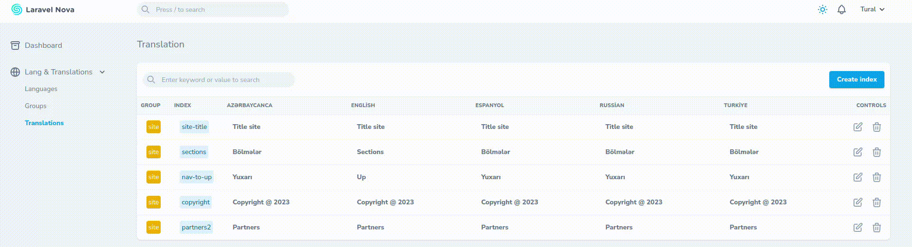

### Translation & Languages for Nova 4

##### * Toggle Switch Field for Nova 3 go to
https://github.com/rzakhanov/translation-nova-laravel

### Requirements
- PHP 8.0 or higher
- Nova 4

## Installation

You can install the package into a Laravel app that uses Nova via composer:

```bash
composer install rzakhanov/translation
```

## Usage

You need to publish **config** and **helper** files first after installation
```bash
php artisan vendor:publish --tag=rzakhanov-translation
```

İt will publish two files

1. [x] /config/rzakhanov-translation.php
1. [x] /app/Helpers/langs_helper.php

**Suggest that don't touch config file. Because it will change dynamically :)**

After it, we have to add menus to the sidebar Nova 4 in provider **NovaServiceProvider.php**

```
  Nova::mainMenu(function () {
    return [
        MenuSection::dashboard(Main::class)->icon('archive'),
      
        MenuSection::make('Lang & Translations', [

            MenuItem::make('Languages')
                ->path('/translation/languages'),
                
            MenuItem::make('Groups')
                ->path('/translation/groups'),

            MenuItem::make('Translations')
                ->path('/translation/list'),

        ])->icon('globe-alt')->collapsible(),

      ];
   });
```

## Menu Screenshot

<br>

## Default lang path

is **lang_path()** or **SITE_LANG_PATH** in .env file


The main logic is that we have 3 parts:
1. [x] **Languages**
2. [x] **Groups**
3. [x] **Translations**

## Explanation
**Languages** are folder parts in defined lang path.For example /lang/en/ . Here **en** is language                                            

**Groups** are files inside of language folders. For example /lang/en/site.php . Here **site** is group

**Translations** are keys inside of language files. For example  /lang/en/site.php contain 'register_key_98' => 'test content', . Here **register_key_98** is translation index


## Overview:
<br>

## Support:
rzaxanovtural@gmail.com

https://websoft.az

Bug Tracker:

https://github.com/rzakhanov/translation-nova-laravel/issues

## License

The MIT License (MIT). Please see [License File](LICENSE.md) for more information.
